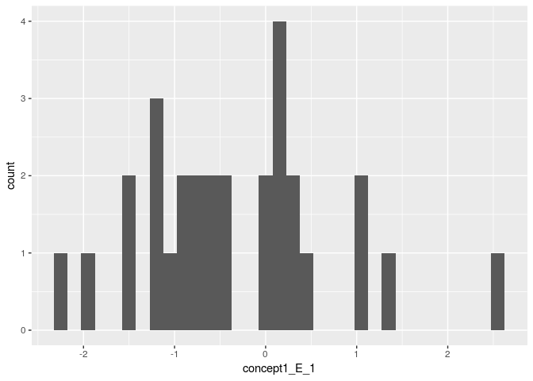

Sociology Project
================
Names

``` r
library("dplyr")
```

    ## 
    ## Attaching package: 'dplyr'

    ## The following objects are masked from 'package:stats':
    ## 
    ##     filter, lag

    ## The following objects are masked from 'package:base':
    ## 
    ##     intersect, setdiff, setequal, union

``` r
library("ggplot2")
library("readr")
```

### Loading and editing the dataframe

``` r
dat <- read.csv(file = "data/numeric.csv", stringsAsFactors = F, header=TRUE) 

class(dat$concept3_E_1)
```

    ## [1] "numeric"

``` r
dat <- dat[-(1:2),]

dat <- dat %>%
  select(-IPAddress, -StartDate, -EndDate, -Status, -Duration..in.seconds., 
         -RecipientEmail, -ExternalReference, -RecipientFirstName, -RecipientLastName, 
         -LocationLatitude, -LocationLongitude, -DistributionChannel, -UserLanguage, -Agree, 
         -comments, -gender_6_TEXT, -RecordedDate, -ResponseId, -Progress, -Finished, -Q86, 
         -Q87, -Q88)

names(dat)
```

    ##  [1] "tutorial1_1"           "tutorial_E_1"         
    ##  [3] "tutorial_neutral_1"    "tutorial_P_1"         
    ##  [5] "tutorial_A_1"          "concept1_E_1"         
    ##  [7] "concept1_P_1"          "concept1_A_1"         
    ##  [9] "concept2_E_1"          "concept2_P_1"         
    ## [11] "concept2_A_1"          "concept3_E_1"         
    ## [13] "concept3_P_1"          "concept3_A_1"         
    ## [15] "concept4_E_1"          "concept4_P_1"         
    ## [17] "concept4_A_1"          "concept5_E_1"         
    ## [19] "Q84_1"                 "concept5_A_1"         
    ## [21] "attention_good_1"      "attention_powerless_1"
    ## [23] "attention_inactive_1"  "gender"               
    ## [25] "Q85"

Categorizing the data by major intent

``` r
premedDat <- dat[c(4, 11),]
bioneuroDat <- dat[c(1, 2, 3, 7, 8, 14, 17, 20, 21, 22),]
engineeringDat <- dat[c(5, 12, 13),]
compsciDat <- dat[c(6, 10, 15, 16, 24),]
psychDat <- dat[c(9),]
econDat <- dat[c(18, 25, 26, 28),]
pubPolDat <- dat[c(23, 25, 27, 28),]
```

### Preliminary Analyses

Calculating the mean results by major
    intent

``` r
colMeans(premedDat)
```

    ##           tutorial1_1          tutorial_E_1    tutorial_neutral_1 
    ##                    NA                  0.65                  0.60 
    ##          tutorial_P_1          tutorial_A_1          concept1_E_1 
    ##                  0.65                 -0.85                 -0.50 
    ##          concept1_P_1          concept1_A_1          concept2_E_1 
    ##                  0.15                  0.90                  2.05 
    ##          concept2_P_1          concept2_A_1          concept3_E_1 
    ##                  0.85                 -0.60                  1.45 
    ##          concept3_P_1          concept3_A_1          concept4_E_1 
    ##                  0.10                  0.40                 -0.15 
    ##          concept4_P_1          concept4_A_1          concept5_E_1 
    ##                  0.80                 -0.55                 -0.15 
    ##                 Q84_1          concept5_A_1      attention_good_1 
    ##                 -0.40                  0.25                 -0.30 
    ## attention_powerless_1  attention_inactive_1                gender 
    ##                 -0.60                 -0.65                  2.50 
    ##                   Q85 
    ##                  1.00

``` r
dat$concept1_E_1
```

    ##  [1]  0.0 -0.8 -1.5  0.1  2.6 -0.9 -0.8  1.0 -1.9  0.3 -1.1  0.3  0.0  0.2
    ## [15] -2.2 -1.2  1.0  0.2 -1.5 -1.2  0.4 -0.5 -0.5 -0.6 -1.2  1.4 -0.6 -0.9
    ## [29]   NA   NA  0.1   NA   NA   NA   NA   NA   NA   NA   NA

``` r
dat %>%
  na.omit() %>%
  summarise(mean = mean(concept1_E_1), min = min(concept1_E_1), max = max(concept1_E_1), sd = sd(concept1_E_1))
```

    ##         mean  min max       sd
    ## 1 -0.2333333 -1.9 2.6 1.248514

``` r
dat %>%
  ggplot(mapping = aes(concept1_E_1)) +
  geom_histogram(binwidth = 0.15)
```

    ## Warning: Removed 10 rows containing non-finite values (stat_bin).

<!-- -->
